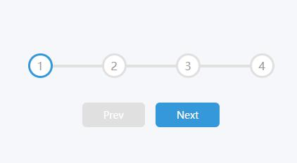
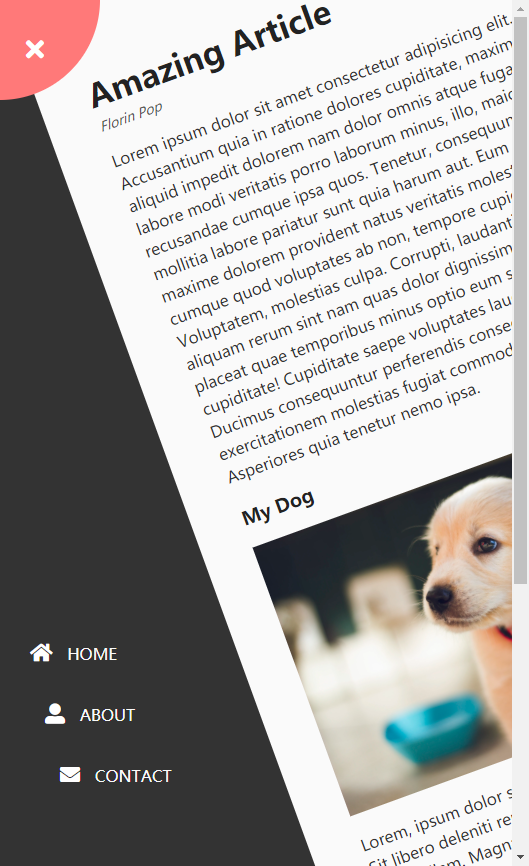

# project
50个小项目

demo1：动态添加类名实现点击效果\
\
demo2：进度条\

demo3：transform: translateX(0)使用\

demo5:\
修改图片颜色为黑白 (100% 灰度):style.filter\
让 DIV 元素半透明：style.opacity

demo6:box.getBoundingClientRect().top
给box设置右边400，然后单数的设置-400px，监听窗口滑动就变为0px
